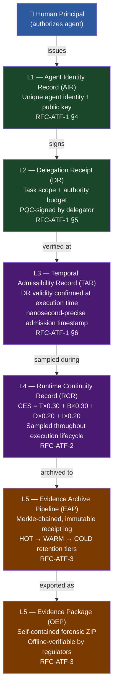

# Agent Trust Fabric (ATF) — Open Protocol Standard

**OMNIX QUANTUM LTD** · Harold Nunes, Editor · May 2026

[](https://doi.org/10.5281/zenodo.20155016)
[](https://papers.ssrn.com/sol3/papers.cfm?abstract_id=6757339)
[](https://papers.ssrn.com/sol3/papers.cfm?abstract_id=6763978)
[](https://csrc.nist.gov/pubs/fips/204/final)
[](./verifier/verify_receipt.py)
[-orange?style=flat-square)](./RFC-ATF-3.md)
[](#invariants)
[](https://creativecommons.org/licenses/by/4.0/)
  [](https://github.com/Costenho19/atf-protocol-standard/actions/workflows/ci.yml)

---

## What is ATF?

**AI agents act. But can you prove who authorized them — and that the authorization was still valid when they acted?**

The Agent Trust Fabric (ATF) is an open protocol for **cryptographically verifiable AI agent authority governance**. It solves three problems that every regulated AI deployment faces:

| Problem | ATF Solution |
|---|---|
| No proof of who authorized an agent action | Delegation Receipts — PQC-signed, chain-traceable to a human principal |
| Authorization may expire or degrade mid-execution | Runtime Continuity Records — continuous authority health at nanosecond precision |
| Evidence is not independently verifiable by regulators | Forensic-grade archive pipeline + self-contained Evidence Packages |

**Any auditor with the issuer's public key can verify the complete authority chain — no access to OMNIX infrastructure required.**

---

## Protocol Architecture



> **ATF-INV-001 (Monotonic Authority Reduction):** Authority budget granted to an agent MUST NOT exceed the delegator's own budget at any delegation depth. Enforced cryptographically at every layer.

---

## The Protocol Stack

| Layer | Artifact | Standard | Invariants |
|---|---|---|---|
| L1 | Agent Identity Record (AIR) | RFC-ATF-1 | ATF-INV-001–006 |
| L2 | Delegation Receipt (DR) | RFC-ATF-1 | ATF-INV-001–006 |
| L3 | Temporal Admissibility Record (TAR) | RFC-ATF-1 | ATF-INV-006 |
| L4 | Runtime Continuity Record (RCR) | RFC-ATF-2 | RGC-INV-001–008 |
| L5 | Evidence Package (OEP) + GPIL + EAP | RFC-ATF-3 | 26 new invariants |

**40 total formally specified invariants** across three RFCs.
Algorithm: **ML-DSA-65** (Dilithium-3, FIPS 204) — post-quantum secure against both classical and quantum adversaries.

---

## Standards

### RFC-ATF-1 — Verifiable AI Agent Authority Delegation

Defines the cryptographic foundation: Agent Identity Records, Delegation Receipts, Trust Lattice, Monotonic Authority Reduction (MAR), and the six core invariants (ATF-INV-001–006).

- **Status:** Published
- **DOI:** [10.5281/zenodo.20155016](https://doi.org/10.5281/zenodo.20155016)
- **SSRN:** [6757339](https://papers.ssrn.com/sol3/papers.cfm?abstract_id=6757339)
- **Specification:** [RFC-ATF-1.md](./RFC-ATF-1.md)

### RFC-ATF-2 — Runtime Governance Continuity

Extends RFC-ATF-1 for long-running executions: Continuity Eligibility Score (CES), Authority Fragmentation Guard (AFG), Escalation Protocol, and Reauthorization Challenge (RC).

- **Status:** Published
- **SSRN:** [6763978](https://papers.ssrn.com/sol3/papers.cfm?abstract_id=6763978)
- **Extends:** RFC-ATF-1
- **Specification:** [RFC-ATF-2.md](./RFC-ATF-2.md)

### RFC-ATF-3 — Governance Policy Interoperability, Evidence Lifecycle & Forensic Verification

Adds Layer 5 — Forensic Evidence Infrastructure: policy interoperability across sovereign runtimes (GPIL), evidence lifecycle classification with HOT/WARM/COLD tiers (ELR), immutable Merkle archive pipeline (EAP), self-contained forensic packages (OEP), and key identity verification protocol (FVP).

- **Status:** Published — May 2026
- **Extends:** RFC-ATF-1 + RFC-ATF-2
- **New compliance designation:** ATF-FEI-Compliant
- **Specification:** [RFC-ATF-3.md](./RFC-ATF-3.md)

---

## Quick Start

**Verify a receipt offline (zero platform dependency):**

```bash
pip install pypqc
python verifier/verify_receipt.py examples/delegation_receipt.json
```

**Run the protocol conformance test suite:**

```bash
pip install pytest pypqc
pytest tests/ -v
```

**Validate a receipt against the JSON Schema:**

```bash
pip install jsonschema
python -c "
import json, jsonschema
schema = json.load(open('schemas/delegation_receipt.schema.json'))
receipt = json.load(open('examples/delegation_receipt.json'))
jsonschema.validate(receipt, schema)
print('VALID')
"
```

**Use the reference implementation:**

```python
from atf_core import create_delegation_receipt, verify_receipt

dr = create_delegation_receipt(
    delegator_id='HUMAN-harold.nunes',
    delegate_id='AID-FINANCE-9B8C7D6E5F4A3B2C',
    task_scope={'action': 'equity_order_execution'},
    budget_granted=60.0,
    budget_delegator=100.0,
)
result = verify_receipt(dr)
print(result['verdict'])  # PASS
```

---

## Repository Structure

```
atf-protocol-standard/
├── RFC-ATF-1.md                         ← Delegation protocol (6 invariants)
├── RFC-ATF-2.md                         ← Runtime continuity (8 invariants)
├── RFC-ATF-3.md                         ← Evidence lifecycle & forensic (26 invariants)
├── examples/
│   ├── delegation_receipt.json
│   ├── temporal_authority_record.json
│   └── runtime_continuity_record.json
├── schemas/
│   ├── delegation_receipt.schema.json
│   └── runtime_continuity_record.schema.json
├── verifier/
│   └── verify_receipt.py                ← Standalone offline verifier (pypqc only)
├── tests/
│   └── test_atf_receipts.py             ← Conformance tests (MAR, CES, tamper)
├── reference-implementation/
│   ├── README.md
│   ├── pyproject.toml
│   └── atf_core/
│       ├── __init__.py
│       ├── receipts.py                  ← DR + RCR creation with invariant enforcement
│       └── verifier.py                  ← Invariant verification
└── CONTRIBUTING.md
```

---

## Invariants

| Family | IDs | RFC | Description |
|---|---|---|---|
| ATF-INV | 001–006 | RFC-ATF-1 | Delegation, signing, MAR, verifiability |
| RGC-INV | 001–008 | RFC-ATF-2 | Continuity, CES, AFG, HALT propagation |
| GPIL-INV | 001–003 | RFC-ATF-3 | Policy interoperability taxonomy |
| ELR-INV | 001–004 | RFC-ATF-3 | Evidence lifecycle retention |
| EAP-INV | 001–007 | RFC-ATF-3 | Archive pipeline integrity |
| OEP-INV | 001–006 | RFC-ATF-3 | Evidence package completeness |
| FEA-INV | 001–005 | RFC-ATF-3 | Export authentication |
| FVP-INV | 007 | RFC-ATF-3 | Forensic verification key identity |
| **TOTAL** | **40** | | |

---

## Compliance Designations

| Designation | Requirements | Layers |
|---|---|---|
| ATF-Compliant | RFC-ATF-1 (6 invariants) | L1–L3 |
| ATF-RGC-Compliant | RFC-ATF-1 + RFC-ATF-2 (14 invariants) | L1–L4 |
| ATF-GPI-Aligned | ATF-RGC-Compliant + signed CRGC with counterpart | L1–L4 + cross-runtime |
| **ATF-FEI-Compliant** | RFC-ATF-1 + RFC-ATF-2 + RFC-ATF-3 (40 invariants) | L1–L5 |

---

## Contributing

See [CONTRIBUTING.md](./CONTRIBUTING.md). We welcome language ports (Go, TypeScript, Rust), conformance test contributions, and feedback on invariant completeness via Issues.

  ## Releases & Changelog

  | Version | RFC | Date | Invariants |
  |---|---|---|---|
  | [v3.0.0](https://github.com/Costenho19/atf-protocol-standard/releases/tag/v3.0.0) | RFC-ATF-3 | May 2026 | 40 total (26 new) |
  | [v2.0.0](https://github.com/Costenho19/atf-protocol-standard/releases/tag/v2.0.0) | RFC-ATF-2 | Mar 2026 | 14 total (8 new) |
  | [v1.0.0](https://github.com/Costenho19/atf-protocol-standard/releases/tag/v1.0.0) | RFC-ATF-1 | Jan 2026 | 6 |

  See [CHANGELOG.md](./CHANGELOG.md) for the full history.

  ## Verifier Tools

  | Tool | Path | Description |
  |---|---|---|
  | Receipt Verifier | [`verifier/verify_receipt.py`](./verifier/verify_receipt.py) | DR + RCR offline verifier — ATF-INV-001–006, RGC-INV-001–004 |
  | OEP Archive Verifier | [`verifier/verify_oep_package.py`](./verifier/verify_oep_package.py) | Forensic ZIP archive verifier — OEP-INV-001–006, EAP-INV-001–007 |

  Both tools have zero dependency on the OMNIX platform (EAP-INV-005).

  ```bash
  pip install pypqc

  # Verify a delegation receipt
  python verifier/verify_receipt.py examples/delegation_receipt.json

  # Verify a full forensic evidence package
  python verifier/verify_oep_package.py evidence_package.zip --public-key issuer.b64
  ```

  ## Conformance Program

  The official ATF Conformance Program provides test vectors for each profile.
  See [CONFORMANCE.md](./CONFORMANCE.md) for the full program.

  | Profile | Invariants | Test Vectors | Badge |
  |---|---|---|---|
  | `ATF-Compliant` | 6 (L1–L3) | 15 (8 positive, 7 negative) | `[]` |
  | `ATF-RGC-Compliant` | 14 (L1–L4) | 26 (14 positive, 12 negative) | `[]` |
  | `ATF-FEI-Compliant` | 40 (L1–L5) | 34 (18 positive, 16 negative) | `[]` |

  ## Language Ports

  | Language | Package | Status | Invariants |
  |---|---|---|---|
  | **Python** (reference) | [`reference-implementation/`](./reference-implementation/) | ✅ Stable | ATF-Compliant + ATF-RGC-Compliant |
  | **TypeScript** | [`ports/typescript/`](./ports/typescript/) | 🔶 Beta | ATF-RGC-Compliant (11 invariants) |
  | Go | — | ❌ Wanted | [Contribute](./CONTRIBUTING.md) |
  | Rust | — | ❌ Wanted | [Contribute](./CONTRIBUTING.md) |

---

## Contact

standards@omnixquantum.com | https://omnixquantum.com

© 2026 OMNIX QUANTUM LTD. Licensed under [CC BY 4.0](https://creativecommons.org/licenses/by/4.0/).
